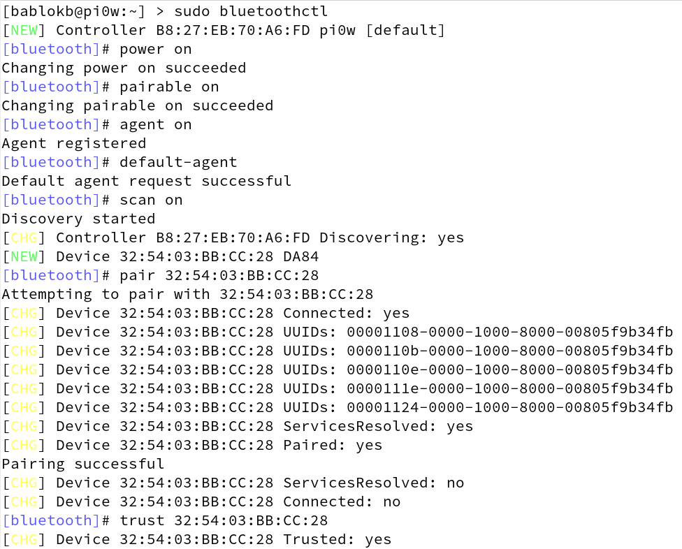

Bluetooth Audio for (headless) Raspbian systems
===============================================

Introduction
------------

Audio on Linux systems has always been rather complicated. ALSA (Advanced
Linux Sound Architecture) is advanced indeed and thus even simple
setups are complicated.

Bluetooth adds another level of complexity. And therefore the forums are
full of posts asking for help on how to connect a Linux system with a
bluetooth speaker or headset. This is no different with Raspbian.

Until Raspbian-Jessie, for bluetooth-devices you additionally needed
PulseAudio, making things even more complicated. With Stretch this has
changed and PulseAudio was replaced with a rather simple helper daemon
called *bluealsa*. Nevertheless, a simple setup is still complicated,
partly because the maintainer of the bluealsa package installs the
daemon only for grafical environments.

This project tries to simplify the setup of bluetooth-audio. Idealy, all
you need to do is to replace a single MAC-address (of you bluetooth-device)
in a single configuration file. There is one caveat though: the project
currently only supports a single device, but anyhow, this should already
cover most of the use-cases.

Prerequisites
-------------

To use bluealsa, you first have to manually pair the Pi with your device
and establish a trust. This is done using the program `bluetoothctl`. The
following screenshot shows all the necessary steps:
.

You don't have to type all these numbers, just type the first few and then press
the TAB key for autocompletion.

After pairing, note down the MAC address of your bluetooth-device, you will
need it later for configuring ALSA.

Installation
------------

To install all necessary software and the template configuration files, run
the following commands:

    git clone https://github.com/bablokb/pi-bt-audio.git
    cd pi-btaudio
    sudo tools/install

The install script will

  - create the `/etc/systemd/system/bluealsa.service`, which will start
    the bluealsa-daemon even on headless systems
  - create a sample `/etc/asound.conf` which will make your bluetooth-device
    the system-wide default audio-device
  - install a watchdog-daemon which will autoconnect to the bluetooth-device
    configured in `/etc/asound.conf`. Note that this is not necessary for
    all bluetooth-devices, but some just don't automatically connect to the Pi.
  - install the utiliy-scripts `btaudio-connect` and `btaudio-disconnect`
    to manually connect and disconnect to the device

Configuration
-------------

After installation, edit the file `/etc/asound.conf` and insert the MAC
address of your bluetooth-device in the line starting with
`defaults.bluealsa.device`:

    pcm.!default "bluealsa"
    ctl.!default "bluealsa"
    defaults.bluealsa.interface "hci0"
    defaults.bluealsa.device "32:54:03:BB:CC:28"
    defaults.bluealsa.profile "a2dp"

That's it for configuration, all scripts and daemons will use this MAC-address.

Now is the time to restart your system. After booting has finished and all
daemons are up and running, your Pi should automatically connect to your
speaker or headset.
